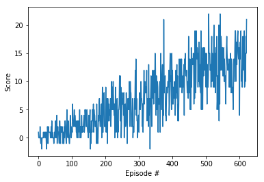

[//]: # (Image References)

[image1]: https://wikimedia.org/api/rest_v1/media/math/render/svg/678cb558a9d59c33ef4810c9618baf34a9577686

# Report

## Learning Algorithm

A standard [Deep Q-learning](https://en.wikipedia.org/wiki/Q-learning#Deep_Q-learning) algorithm is used to solve the enviroment. The neural network behind the algorithm uses four fully-connected layers. The layer sizes are as follows:

 1. 37 -> 128
 2. 128 -> 128
 3. 128 -> 64
 4. 64 -> 4

The first three layers are run through a Relu activation.

The hyper parameters for the DQN method are found here:

```python
BUFFER_SIZE = int(1e5)  # replay buffer size
BATCH_SIZE = 64         # minibatch size
GAMMA = 0.99            # discount factor
TAU = 1e-3              # for soft update of target parameters
LR = 5e-4               # learning rate 
UPDATE_EVERY = 8        # how often to update the network
```

These were largely left unchanged from the previous example the code was taken from. Only the `UPDATE_EVERY` parameter was increased since more "steps" could occur before any reward was given due to the nature of the problem.

### Deep Q-learning Explanation

Q-learning works by trying to find the best policy, represented as a table of all possible state and actions and the associate value with them (called Q). For every state (s_t), the agent takes an action (a_t) based on the current policy and looks at rewards (r_t) returned by the enviroment for that action and the best estimated value for all actions for the resulting state (s_t+1) of the action. The sum of these minus the value out of Q(s_t, a_t) for the original state and action taken tell us how much that value of Q(s_t, a_t) needs to be updated. There's two hyper-parameters that influence how much of the value gets updated. The first (gamma) is the discount factor for future rewards (how much should we value future value versus current value) and the overall learning rate.

![Q learning][image1]

Deep Q-learning replaces the Q-table (policy) with two neural networks. One that is held consistent over several updates (target network) to provide a smoother expected future value function and the network that is updated with every action (local network). After those several updates the target network is set equal to the local network, so they are nearly-duplicate networks. The Deep Q-learning also adds a Replay buffer allowing the agent to learn multiple times from one experience. This is created in a first-in, first out queue and then sampled randomly (to decorelate the experiences).

## Plot of Rewards



After hitting 622 episodes, the next 100 mainted an average score of 13.0. It looks like there's potential for higher average scores if it were to train further.

## Ideas for Future Work

In order to train the agent quicker to solve the enviroment, further experimentation with different neural network architectures could lead to advantages over this architecture. Of the "Rainbow" series of DQN improvements, I think adding prioritized experience replay could help train the agent better, especially towards the end of training. This is because once the network learns the basic "avoid blue"/"turn to yellow" experiences, it could further optimize it's behavior by balancing the cases where avoiding blue and turning to yellow might be in conflict. These cases won't happen often, but will help it achieve a higher performance, hence a prioritized experience replay.
